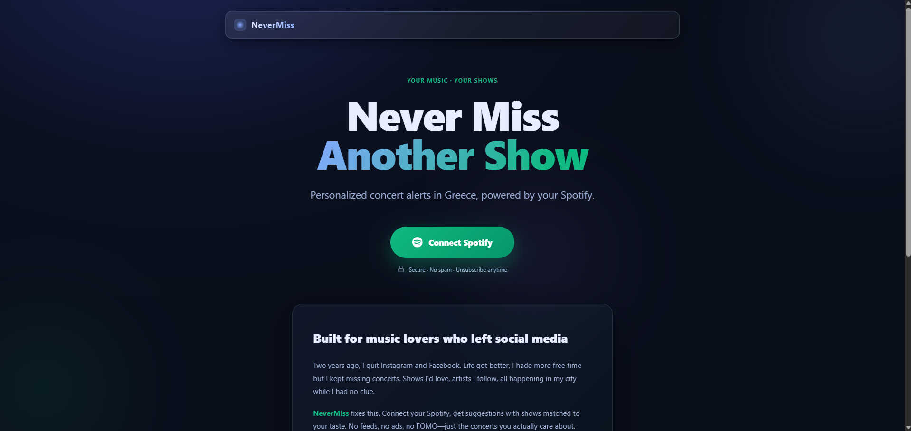
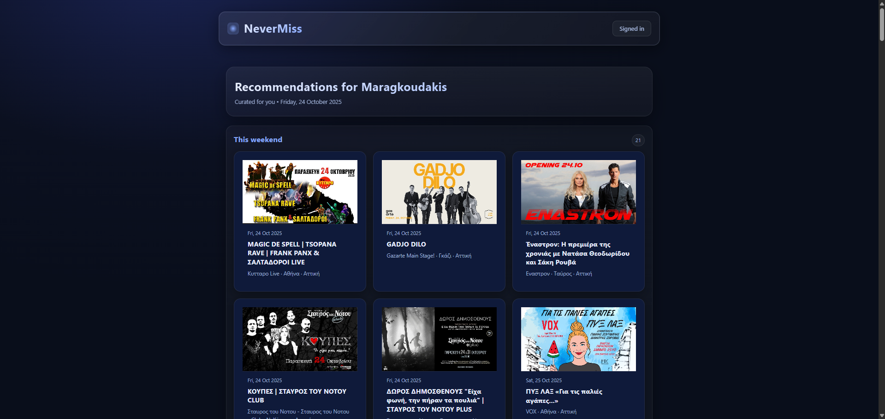
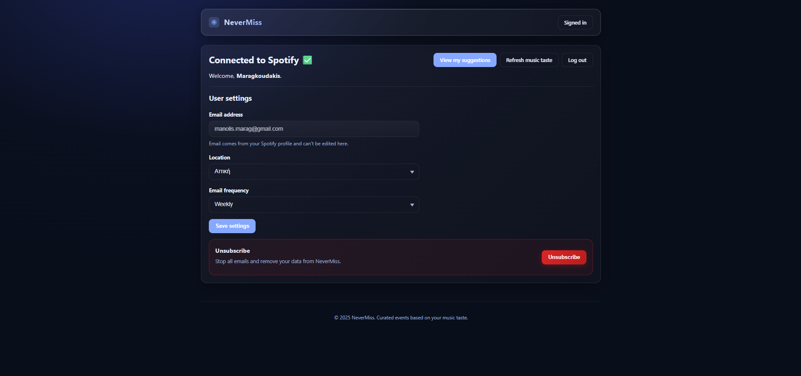

# NeverMiss

**AI-curated concert recommendations based on your Spotify listening history.**

**Live at:** [http://nevermiss.qzz.io](http://nevermiss.qzz.io)

<p align="center">  </p>


NeverMiss is a web application that analyzes your Spotify music taste and matches it with upcoming concerts and live events in Greece. Using AI-powered filtering, it delivers personalized event recommendations without requiring social media accounts.

---

## Overview

NeverMiss solves a common problem for music lovers who have left social media: discovering concerts by artists they care about. The application connects to your Spotify account, analyzes your listening habits, and sends weekly email digests with relevant local shows.


<p align="center"> <br> <em>Preview of AI-ranked suggestions before they’re sent in the newsletter.</em> </p>


### Key Features

- **Spotify Integration**: Analyzes your top artists and genres to understand your music preferences
- **AI-Powered Matching**: Uses Google Gemini to intelligently filter and rank events based on your taste
- **Personalized Newsletters**: Beautiful HTML email digests with event details, venues, and dates
- **Location-Based**: Supports multiple regions across Greece (Athens, Thessaloniki, Patras, and more)
- **Flexible Scheduling**: Choose weekly or biweekly update frequency
- **Smart Organization**: Events grouped into intuitive sections (This Week, This Weekend, Next Week, Coming Soon)
- **Timezone Aware**: All dates and times localized to Europe/Athens

---

## Architecture

<p align="center"> <br> <em>Set location, email, and frequency preferences (Europe/Athens timezone aware).</em> </p>

### Web Application

The Flask-based web application (`app.py`) provides:

- **OAuth 2.0 Authentication**: Secure Spotify login with PKCE flow
- **User Preferences**: Customizable location and email frequency settings
- **Background Jobs**: Automated taste profile updates and event matching
- **Email Delivery**: Scheduled newsletter generation and distribution
- **Unsubscribe Management**: One-click unsubscribe functionality

### Core Components

1. **Authentication Flow**: 
   - PKCE-secured OAuth with Spotify
   - Token refresh handling
   - Session management

2. **Taste Analysis** (`utils/tastes.py`):
   - Fetches user's top artists and tracks from Spotify
   - Extracts genre preferences
   - Stores taste profiles in SQLite database

3. **Event Matching** (`utils/suggestion_utils.py`):
   - Queries AI model with user taste and event data
   - Validates responses using Pydantic schemas
   - Ranks events by relevance score

4. **Newsletter Generation**:
   - Renders responsive HTML templates
   - Groups events by date range
   - Includes event images, venue details, and ticket links

---

## Requirements

### API Keys

- **Spotify Developer App**: Create an app at [Spotify Developer Dashboard](https://developer.spotify.com/dashboard)
  - Note your Client ID and Client Secret
  - Set redirect URI to `http://localhost:8080/callback` (or your production URL)

- **Google Gemini API Key**: Get your key from [Google AI Studio](https://aistudio.google.com/api-keys)

### Environment Variables

Create a `.env` file in the project root:

```env
SPOTIFY_CLIENT_ID=your_client_id
SPOTIFY_CLIENT_SECRET=your_client_secret
SPOTIFY_REDIRECT_URI=http://localhost:8080/callback
GEMINI_API_KEY=your_gemini_api_key
FLASK_SECRET=your_random_secret_key
INVITE_FORM_URL=https://forms.gle/your-form-id
```

---

## Usage

### Web Application

1. Navigate to the homepage
2. Click "Connect Spotify" to authenticate
3. Set your preferences:
   - Email address for newsletters
   - Location (city/region in Greece)
   - Update frequency (weekly or biweekly)
4. The system will analyze your Spotify taste and begin sending personalized recommendations

### CLI Newsletter Generation

For manual newsletter generation or testing:

```bash
python generate_newsletter.py
```

This generates a standalone HTML newsletter based on your Spotify profile.

---

## Database Schema

The application uses SQLite with the following main tables:

- **users**: Stores user profiles, preferences, and Spotify tokens
- **user_tastes**: Caches analyzed music preferences (artists, genres, tracks)
- **events**: Scraped upcoming events with venue, date, and details
- **user_suggested_events**: AI-matched events for each user with relevance scores

---

## Scheduling

The application uses APScheduler for:

- **Daily event scraping**: Updates event database from sources
- **Taste refresh**: Periodic updates of user music preferences
- **Newsletter delivery**: Sends emails based on user frequency settings

---

## API Endpoints

### Public Routes

- `GET /` - Homepage (landing page or authenticated dashboard)
- `GET /auth/spotify` - Initiates Spotify OAuth flow
- `GET /callback` - OAuth callback handler
- `GET /invite-only` - Access request page for closed beta
- `GET /unsubscribe` - Removes user and stops emails

### Authenticated Routes

- `POST /save_info` - Updates user preferences
- `GET /refresh_taste` - Manually refreshes Spotify taste analysis
- `GET /suggestions/<user_uuid>` - Preview upcoming newsletter
- `GET /me/top` - Debug endpoint for Spotify top artists/tracks

---

## Design Philosophy

NeverMiss was built to solve a specific problem: staying connected to live music without social media. The application prioritizes:

- **Privacy**: Minimal data collection, no third-party tracking
- **Simplicity**: Clean interface focused on essential functionality
- **Reliability**: Validated AI responses, graceful error handling
- **User Control**: Easy preference management and opt-out

---

## Technology Stack

- **Backend**: Flask (Python 3.9+)
- **Database**: SQLite with custom schema
- **AI**: Google Gemini 1.5 Flash
- **Authentication**: OAuth 2.0 with PKCE
- **Scheduling**: APScheduler
- **Email**: Custom HTML templates
- **Frontend**: Jinja2 templates, vanilla CSS

---

## License

MIT License - See LICENSE file for details

---

## Contributing

Contributions are welcome. Please open an issue to discuss proposed changes before submitting pull requests.

---

## Support

For bugs or feature requests, please open an issue on GitHub.